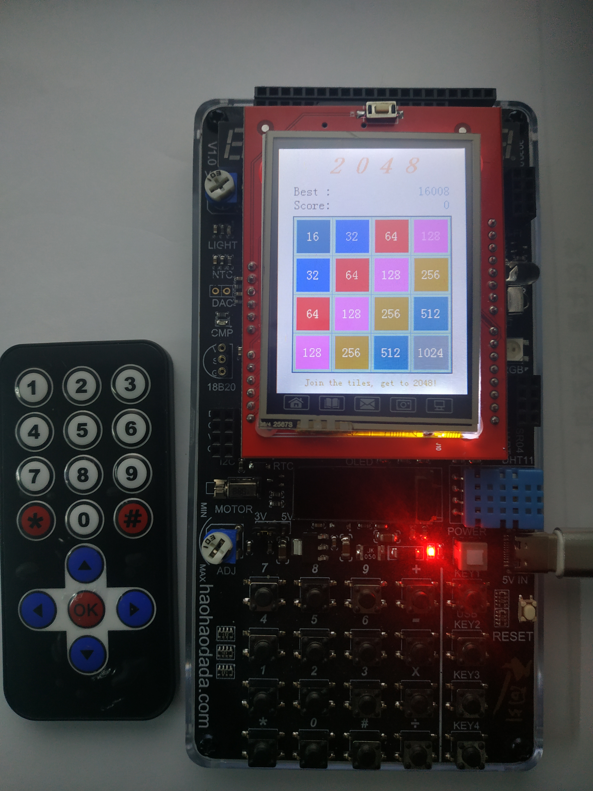
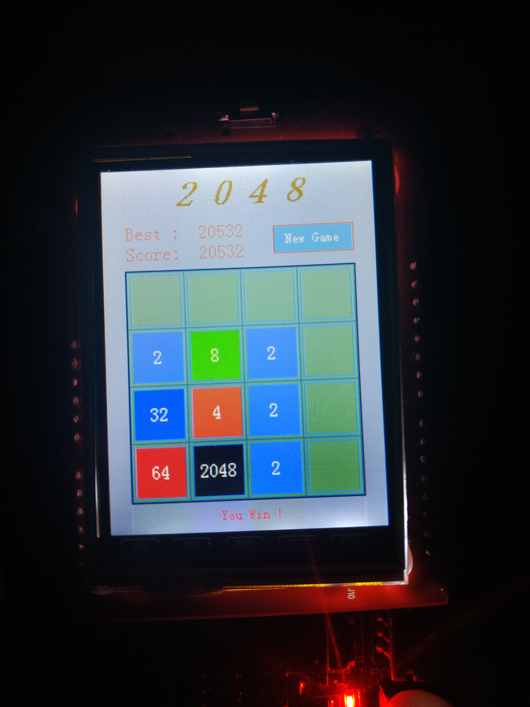

# stc8_game

**说明**: 一个游戏机。。。没事干，就做着玩玩。。。

**板型**: 天问51（STC8H8K64U）

**开发平台**: win10   keil5

**控制方式**: IR红外遥控器控制、板上矩阵按键（具体控制方式参考代码内注释）

**开发进度**:

- [ ] 游戏主体实现
    - [x] 2048
      - [x] 游戏界面绘制
      - [x] 游戏逻辑实现
      - [x] 计分系统 
    - [ ] 贪吃蛇
      - [x] 游戏界面绘制
    - [ ] 数独
    - [ ] 五子棋 
- [ ] 游戏选择界面
- [ ] 优化

**坑**:

- eeprom多次写入，在写入前需要先擦除扇区，否则数据无法写入
- 将要读取、动态存储到eeprom的变量统一进行管理，可解决读写冲突

**附图**:

